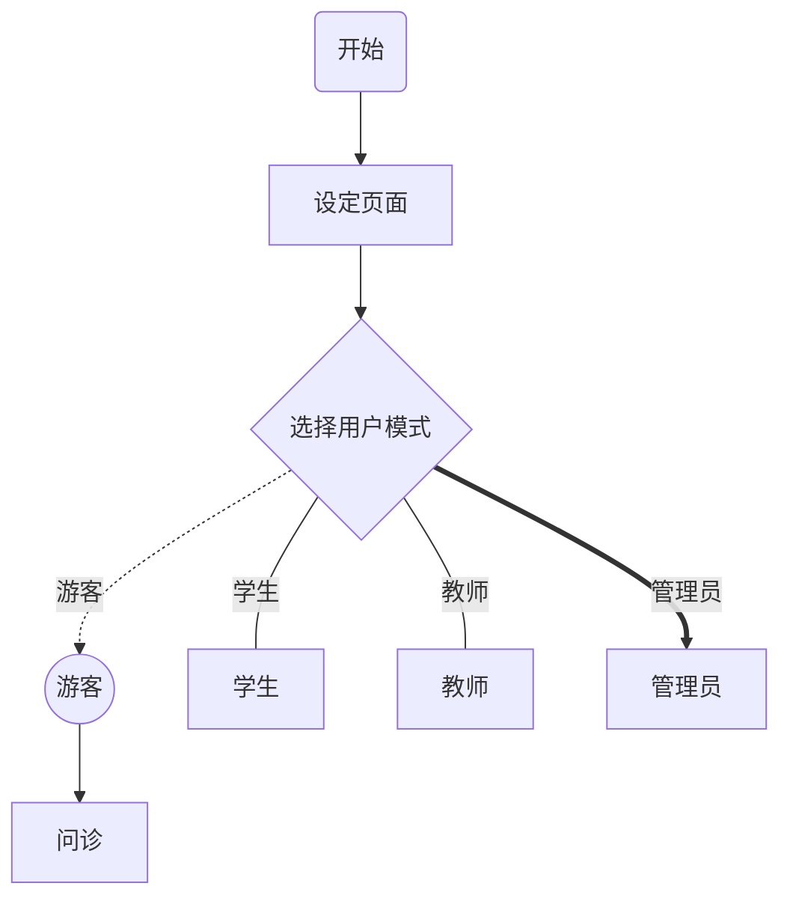

# 流程图

```mermaid
graph TB
    bvc(开始) --> set_page_header[设定页面]
    set_page_header --> mode{选择用户模式}
    mode -.-> |游客|visitor((游客))
    mode --- |学生|student[学生]
    mode --- |教师|teacher[教师]
    mode ==> |管理员|admin[管理员]    
    
    visitor --> inquiry[问诊]
```

